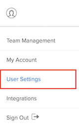

# Exercise 1: Configure Automated Testing on SauceLabs

## Part One: Set Sauce Labs Account Credentials
1. Checkout branch `01_set_sauce_credentials `. Open `src > test > java > exercises > FullJourneyTest.java`
2. Login to [www.saucelabs.com](https://www.sauceslabs.com), and navigate to the User Settings section of your account profile.
    
    
    
3. Copy and paste your Username and SauceLabs Access Key to your local clipboard
4. Navigate back to IntelliJ and in the class `FullJourneyTest.java`, update the following variables:
      ```
      String sauceUserName = "SAUCE_USERNAME";
      String sauceAccessKey = "SAUCE_ACCESS_KEY";
      ```
5. Save and run your test by typing in the following in your terminal:
    ```
    mvn test
    ``` 
    you should see the results appear in your Sauce Labs Test Dashboard
    
## Part Two: Set Environment Variables
    
6. Next, modify the `sauceUserName` and `sauceAccessKey` variables to use Environment Variables:

    ```
       String sauceUserName = System.getenv("SAUCE_USERNAME");
       String sauceAccessKey = System.getenv("SAUCE_ACCESS_KEY");
    ```
7. At the bottom of IntelliJ select the Terminal tab:
8. In the Terminal set your Sauce Labs Environment variables:   
   ###### Mac OSX:
   ```
   $ export SAUCE_USERNAME="your saucelabs username"
   $ export SAUCE_ACCESS_KEY="your saucelabs API access Key"
   ```
   ###### Windows:
   ```
   > set SAUCE_USERNAME="your saucelabs username"
   > set SAUCE_ACCESS_KEY="your saucelabs API access Key"
   ```
   > To set an environment variables permanently in Windows, you must append it to the `PATH` variable.
   > Go to "Control Panel > System > Windows version > Advanced System Settings > Environment Variables > System Variables > Edit > New. Then enter the "Name" and "Value"
   
9. Test the environment variables
    ###### Mac OSX:
    ```
    $ echo $SAUCE_USERNAME
    $ echo $SAUCE_ACCESS_KEY
    ```
    ###### Windows:
    ```
    echo %SAUCE_USERNAME%
    echo %SAUCE_ACCESS_KEY%
    ```
10. Run your test using Maven
    ```
    mvn test
    ```
    You should see the following build info appear (after sometime) in your console:
    
    
    > ** Warning:**
    > If you have problems propogating your envirnoment variables into IntelliJ, try refreshing your by running any of the following commands: 
    >  * `$ source ~/.bashrc`
    >  * `$ source ~/.bash_profile`
    >  * `$ source /etc/profile`
    
    > Or append the details to your `.bash_profile` to set them globally
    > ```
    >    vim ~/.bash_profile
    >    export SAUCE_USERNAME="xxx"
    >    export SAUCE_ACCESS_KEY="XXXXXXX-XXXX-XXXX-XXXXXXXXXXX"
    >    launchctl setenv SAUCE_USERNAME $SAUCE_USERNAME
    >    launchctl setenv SAUCE_ACCESS_KEY $SAUCE_ACCESS_KEY
    > ```
  
</br>

## Part Three: Abstract Test Details:
1. In `src/test/java/exercises/` create a new class called `LoginFeatureTest`.
2. Create a new class method with the following:
    ```
    public class LoginFeatureTest {
        protected WebDriver driver;
        @Test
        public void ShouldBeAbleToLogin(Method method) 
            throws MalformedURLException 
        {
    
        }
    }
    ```
3. In `FullJourneyTest`, copy everything from:
    
    `Line 21`
    ```
    // Input your SauceLabs Credentials
    ```
    to `Line 87`:
    ```
    driver.findElement(By.cssSelector(loginBtn)).click();
    ```
    and paste it into the `LoginFeatureTest` class method: `ShouldBeAbleToLogin`
4. Delete unecessary element locators such as:
    ```
     String backpack = "div:nth-child(1) > div.pricebar > button";
        String jacket = "div:nth-child(4) > div.pricebar > button";
        String cart = "#shopping_cart_container";
        String rmvBtn = "div:nth-child(4) > div.cart_item_label > div.item_pricebar > button";
        String continueShopping = "a.cart_cancel_link";
        ...
    ```
5. Add this `Assertion` at the end of the test:
    ```
    Assert.assertEquals("https://www.saucedemo.com/inventory.html", driver.getCurrentUrl());
    ```
6. Run the test:
    ```
    mvn test -Dtest=LoginFeatureTest
    ```
7. Next we need to create an **`@AfterMethod` to send the test results to Sauce Labs and add a `@BeforeMethod` that takes care of the driver instantiation before we run our test:
    *   ```
        @AfterMethod
        public void teardown(ITestResult result) {
            ((JavascriptExecutor)driver).executeScript(
                "sauce:job-result=" + (result.isSuccess() ? "passed" : "failed"));
            driver.quit();
        }
        ```
    *   ```
        @BeforeMethod
        public void setUp(Method method) throws MalformedURLException
        {
            // Input your SauceLabs Credentials
            String sauceUsername = System.getenv("SAUCE_USERNAME");
            String sauceAccessKey = System.getenv("SAUCE_ACCESS_KEY");

            MutableCapabilities capabilities = new MutableCapabilities();

            //sets browser to Safari
            capabilities.setCapability("browserName", "Safari");

            //sets operating system to macOS version 10.13
            capabilities.setCapability("platform", "macOS 10.13");

            //sets the browser version to 11.1
            capabilities.setCapability("version", "11.1");

            //sets your test case name so that it shows up in Sauce Labs
            capabilities.setCapability("name", method.getName());
            capabilities.setCapability("username", sauceUsername);
            capabilities.setCapability("accessKey", sauceAccessKey);

            //instantiates a remote WebDriver object with your desired capabilities
            driver = new RemoteWebDriver(new URL("https://ondemand.saucelabs.com/wd/hub"), capabilities);
        }
        ```
    Your test class should now look like this:
        ```
        @Test
        public void ShouldBeAbleToLogin() {

        //navigate to the url of the Sauce Labs Sample app
        driver.navigate().to("https://www.saucedemo.com");

        // Ignore the following selectors
        String username = "standard_user";
        String password = "secret_sauce";
        String userField = "[data-test='username']";
        String passField = "[data-test='password']";
        String loginBtn = "[value='LOGIN']";

        // wait 5 seconds
        driver.manage().timeouts().implicitlyWait(5, TimeUnit.SECONDS);
        
        // send username keystrokes
        driver.findElement(By.cssSelector(userField)).sendKeys(username);

        // send password keystrokes
        driver.findElement(By.cssSelector(passField)).sendKeys(password);

        // click login button to submit keystrokes
        driver.findElement(By.cssSelector(loginBtn)).click();

        // assert that the next page opened
        Assert.assertEquals("https://www.saucedemo.com/inventory.html", driver.getCurrentUrl());
        }
        ```
8. Run the final test of this exercise:
    ```
    mvn test -Dtest=LoginFeatureTest
    ```
9. Use `git stash` or `git commit` to discard or save your changes. Checkout the next branch to proceed to the next exercise
    ```
    git checkout 02_page_objects
    ```