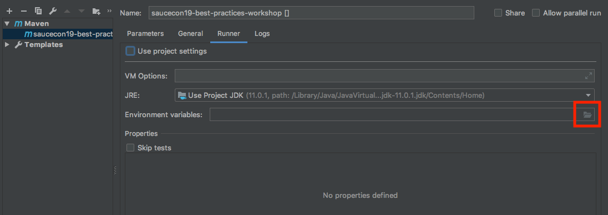
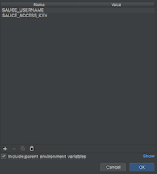

# Exercise 1: Configure Automated Testing on SauceLabs

##Part One: Set Sauce Labs Account Credentials
1. Checkout branch `01_set_sauce_credentials `. Open `test > exercises > Exercise1.java`
2. Login to [www.saucelabs.com](https://www.sauceslabs.com), and navigate to the User Settings section of your account profile.
    
    
    
3. Copy and paste your Username and SauceLabs Access Key to your local clipboard
4. Navigate back to IntelliJ and in the class `Exercise1.java`, update the following variables:
      ```
      String sauceUserName = "SAUCE_USERNAME";
      String sauceAccessKey = "SAUCE_ACCESS_KEY";
      ```
5. Save and run your test, you should see the following appear in your Sauce Labs Test Dashboard:
    
    

##Part Two: Set Environment Variables in a Run Configuration
    
6. Next, modify the `sauceUserName` and `sauceAccessKey` variables to use Environment Variables:

    ```$xslt
       String sauceUserName = System.getenv("SAUCE_USERNAME");
       String sauceAccessKey = System.getenv("SAUCE_ACCESS_KEY");
    ```
7. Create a new Run Configuration in IntelliJ
    * Select **Run > Edit Configurations**
    * Select the `+` Symbol to add a new configuration
    * Name the configuration **Exercise1**
    * Ensure the following: `test.exercises.Test1`, exists in the **Class** field
    * Select the folder icon next to the **Environment variables** field
    
        
        
    * Add `SAUCE_USERNAME` and `SAUCE_ACCESS_KEY` with approrpirate values
    
        
        
    * Save and Exit 
    
 8. Run your test script again using the IntelliJ toolbar
    
    